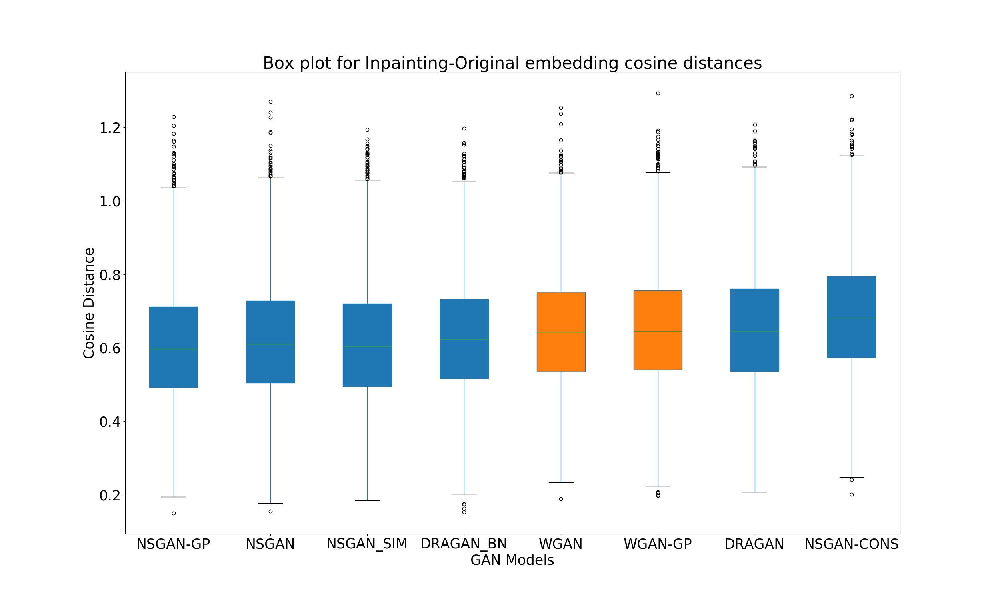
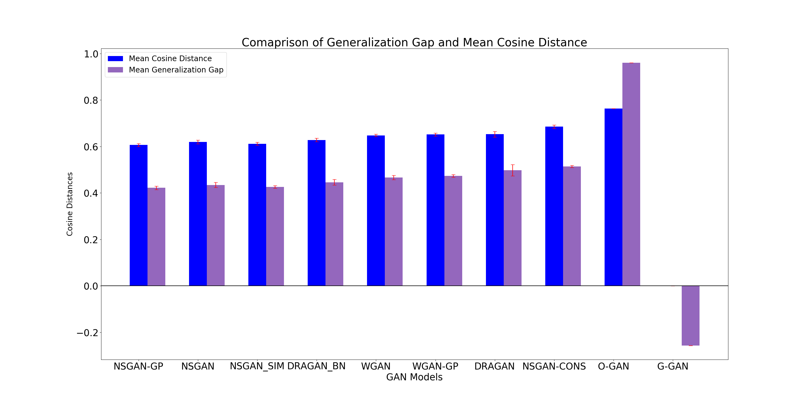

# Evaluating the Effect of Regularization Strategies on Inpainting performance of GANs

### Preliminaries:
This repository was forked from [here](https://github.com/khanrc/tf.gans-comparison), I advise you to go through it's excellent [README](https://github.com/khanrc/tf.gans-comparison/blob/master/README.md) for details about individual GAN models and how to train them. This code was used to run experiments for my [master thesis](https://www.dropbox.com/s/7jpie3kj5ejp501/Thesis_IshaanBhat_Final.pdf?dl=0) at TU Eindhoven. In this experiment, all GANs are trained on the CelebA dataset.

The following packages can be installed using pip/conda. I used the Anaconda package manager and used the following YAML file to install dependencies:
```
name: <environment name>

dependencies:                                                                                                                                   
    - numpy                                                                                                                                                   
    - pandas                                                                                                                                                              
    - tensorflow-gpu                                                                                                                                                          
    - scipy                                                                                                                                                               
    - opencv                                                                                                                                                              
    - matplotlib 
```

If you are running this code from within TU/e, please request access to the HPC Data Mining server and run the ready-to-use run scripts (.sh and batch files) that are part of this repo. For other, ignore. 

### Running the experiment

#### Part - 1

The first part of the experiment consists of the following steps: 
##### Splitting the dataset

Before starting the training, we split the dataset into the train and test set. We hold out 1000 images randomly from the dataset and inpainting is performed on these images. Run the [split_train_test.py](https://github.com/kilgore92/tf.gans-comparison/blob/run_exp/split_train_test.py) script to do this. Edit the data locations as required.

##### Converting the data to TFRecords

To train the GAN models, the training image data must be converted to the TFRecords format. Use the [convert.py](https://github.com/kilgore92/tf.gans-comparison/tree/run_exp/models) to do this. 

##### Training the GANs

The tensorflow code for different GAN models can be found in the [models](https://github.com/kilgore92/tf.gans-comparison/tree/HPC/models) directory. To train the GANs, run the [train.py](https://github.com/kilgore92/tf.gans-comparison/blob/HPC/train.py) script. For information about the cmd line arguments, please refer the original [README](https://github.com/khanrc/tf.gans-comparison/blob/master/README.md). For those running this code on the TU/e HPC server, you can use the bash script [run_training_all.sh](https://github.com/kilgore92/tf.gans-comparison/blob/run_exp/run_training_all.sh).

##### Inpaint Images

Once the GAN model(s) is(are) trained, the [complete.py](https://github.com/kilgore92/tf.gans-comparison/blob/run_exp/complete.py) should be used to perform inpainting. This script is a slightly tweaked version from the one found [here](https://github.com/bamos/dcgan-completion.tensorflow/blob/master/complete.py). To better understand the inpainting technique, I would advise you to either refer to Section 2.2 of my [thesis](https://www.dropbox.com/s/7jpie3kj5ejp501/Thesis_IshaanBhat_Final.pdf?dl=0) or the [original paper](https://arxiv.org/abs/1607.07539).

For those running this code on the TU/e HPC server, you can use the bash script [run_completion_all.sh](https://github.com/kilgore92/tf.gans-comparison/blob/run_exp/run_completion_all.sh).

##### Creating an image database

In this step, we arrange all the original images and inpaintings (done by different GANs) into a convinient, common directory structure. To do so run the script [split_train_test.py](https://github.com/kilgore92/tf.gans-comparison/blob/run_exp/split_train_test.py) with the option *- - db*.

#### Part - 2

For the next part of the experiment, please clone this [repository](https://github.com/kilgore92/facenet/tree/master) in a separate location. In this part, we use Convolutional Neural Networks to learn a mapping from image to embeddings, such that distances in such an embedding space correspond to semantic distances between images. More details about these techniques can be found [here](https://github.com/davidsandberg/facenet/blob/master/README.md). These networks can be trained from scratch, but I have used a pre-trained model which can be downloaded from [here](https://drive.google.com/open?id=1EXPBSXwTaqrSC0OhUdXNmKSh9qJUQ55-). 

##### GAN Comparison

In this step, we compute the cosine similarity between the embeddings for the original image and the embedding for each of the inpaintings. The idea is that the best performing GAN will have the smallest mean distance between the inpainting it produced and the original. To do so, use the following script from the root dir of the folder:
```
python src/gans_compare.py --model <path to trained embedding model> --image_files <path to database created in previous step>
``` 

##### Computing train/test embeddings

Furthermore, for an additional result, we need to compute embeddings for train, test and inpainted images. 

For train embeddings:
```
python src/calculate_embeddings.py --model <path to trained embedding model> --images_dir <training images dir> --src train
```

For test embeddings:
```
python src/calculate_embeddings.py --model <path to trained embeddings model> --images_dir <path to database created> --src test
```

For inpainting embeddings:

```
python src/calculate_embeddings.py --model <path to trained embeddings model> --images_dir <path to database created> --src inpaint --gan <GAN model that created the inpaintings. Valid options : 'dcgan' or 'dragan' or 'wgan' etc.>
```

This script will create a folder called *embeddings* in your cwd and stored picked dictionaries that maintain a map between the image file path and the embedding vector. 

#### Part - 3

In the final part of the experiment, we will use the the embeddings calculated to calculate the *Generalization Gap* metric. Please refer to Section 5.2 of my [thesis](https://www.dropbox.com/s/7jpie3kj5ejp501/Thesis_IshaanBhat_Final.pdf?dl=0). For this we use the script [underfit.py](https://github.com/kilgore92/tf.gans-comparison/blob/run_exp/underfit.py). The usage is as follows:
```
python3 underfit.py --model <GAN model, valid options : 'dcgan','dragan' ...> --emb <Directory where the pkl files in the previous step were dumped>
```
This script generates a nested folder structure for each GAN, which shows the original image, inpainting and the nearest neighbour in the training set. It also provides cosine distances that will be used to compute the gap metric. 

This concludes the tutorial on running this experiment and generating results. The code I used to analyze and plot the results can be found [here](https://github.com/kilgore92/analysis).

### Results

##### Image Similarity between Original and Generated Inpaintings



##### GAN model performance on the Generalization Gap metric



In case of any issues/fixes needed I can be found at ishaan[dot]bits92[at]gmail[dot]com. 

